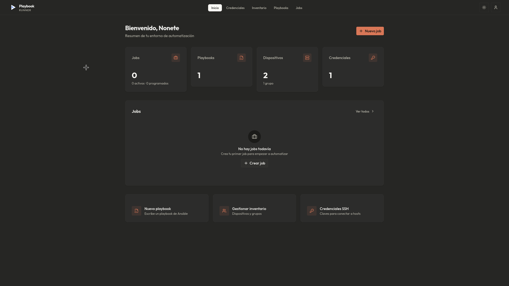
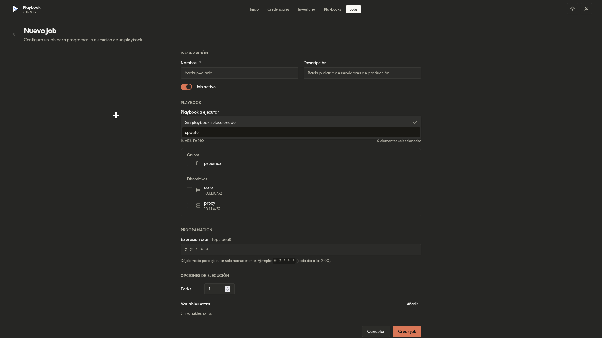
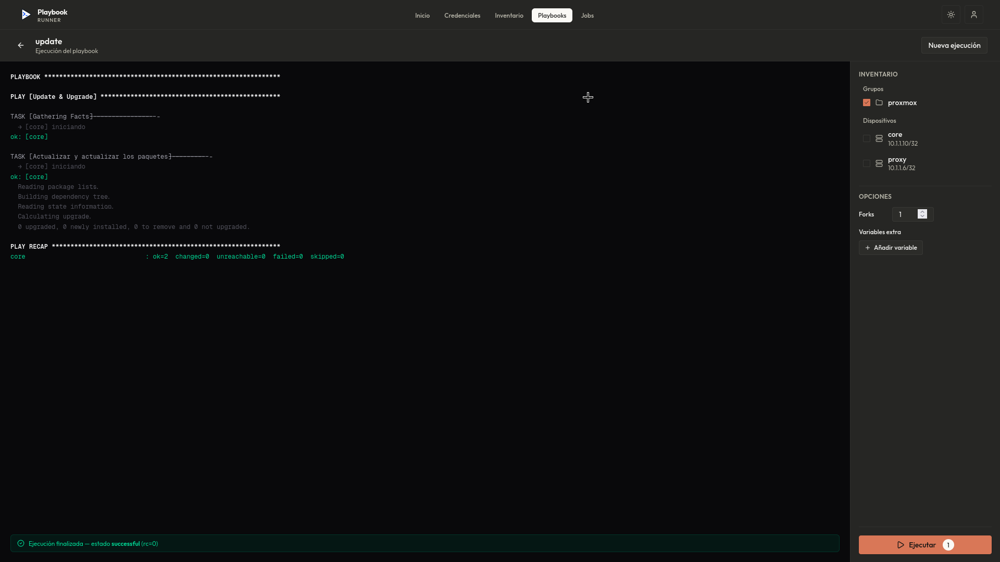
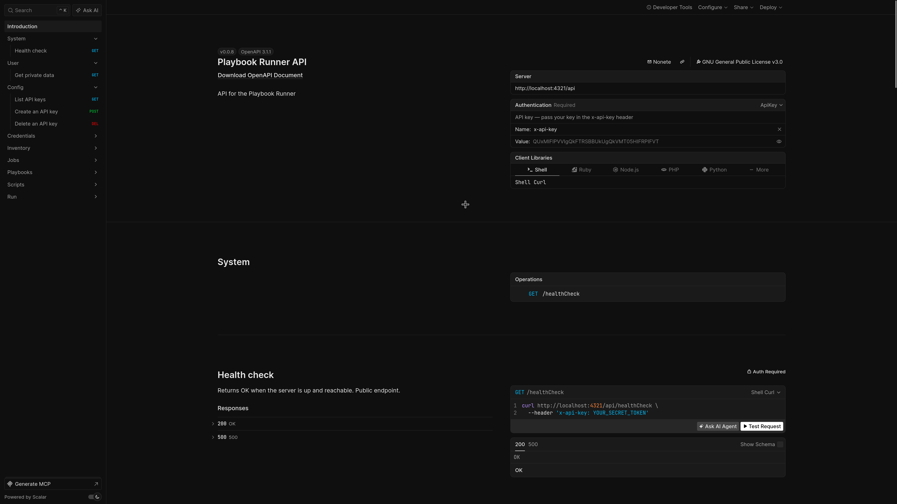

# playbook-runner

A self-hosted web UI to manage and run [Ansible](https://www.ansible.com/)
playbooks against your inventory — without the operational weight of AWX or
Ansible Tower.

If you've ever SSH'd into a box, run `ansible-playbook site.yml` and tailed
the output in another terminal, this app gives you a browser tab and a database
for all of that: playbooks, ad-hoc commands, SSH credentials, devices, groups,
scheduled runs, and a live log of every execution.

## TL;DR — install on a server

Create an empty directory for the deployment, `cd` into it, and run:

```bash
curl -fsSL https://raw.githubusercontent.com/Nonetss/playbook-runner/v0.0.8/scripts/bootstrap.sh | bash
```

That runs `scripts/bootstrap.sh`, which asks you for the admin user/password and
a few more things, generates secrets with `openssl`, writes a `.env` and a
`compose.yml` **in the current directory** (the production overlay, saved under
that name so a plain `docker compose up -d` picks it up), pulls the images from
`ghcr.io`, and brings the stack up. You end up with everything running at
`http://<your-host>:4321` (or whatever port you chose). See
[Quick start (production)](#quick-start-production) for the manual version.

> The script is interactive even when piped, because it reads your answers from
> `/dev/tty`. It writes into the directory you run it from — not into a clone —
> so an empty folder is all you need. To pin a different version, prefix it with
> `PB_REF=<tag>`.

## Screenshots

**Dashboard** — at a glance: jobs, playbooks, devices, and credentials, with
quick-access shortcuts to the most common actions.



**New job** — pick a playbook, select target groups or individual devices, set
an optional cron schedule, tune forks, and inject extra variables.



**Live execution** — output streams into the browser as ansible-runner emits
it. The inventory panel on the right shows which hosts are in scope.



**API reference** — every endpoint is documented in an interactive OpenAPI
reference (Scalar) served at `/scalar`, with request/response schemas, error
codes, and ready-to-run `curl`/client snippets. The raw spec lives at
`/openapi.json`.



## What you can do with it

- **Inventory** — store devices (host, port, IP) and groups. A device
  belongs to a credential (SSH key + user), so a run can pick a group and
  the right key follows along to every host.
- **Credentials** — store SSH credentials (user + private/public key). You
  can **import** an existing key or **generate** a fresh ed25519 pair right
  in the browser, and copy a ready-made **provisioning script** that creates
  the user, authorizes the public key, and grants passwordless sudo on a
  target host.
- **Playbooks** — write Ansible YAML in the browser, save it, version it in
  the database. No more `scp`ing `.yml` files around.
- **Run on demand** — pick a playbook, pick a group (or a hand-picked set
  of devices), click *Run*. Output streams into the browser via SSE
  (Server-Sent Events), so you see `PLAY [...]` and `TASK [...]` lines as
  ansible-runner emits them, with no polling.
- **Ad-hoc commands** — for quick one-offs that don't deserve a playbook,
  the *Comandos* page runs an ad-hoc Ansible module (`shell` or `command`,
  with optional `become`) against a selection of devices/groups and streams
  the output live, same as a playbook run.
- **Schedule jobs** — same thing but with a cron expression. The backend
  keeps a cron loop in-process (`JOB_SCHEDULER_ENABLED=1`) and fires
  scheduled jobs on time. Disable it (`=0`) if you scale the backend to
  multiple replicas and run the scheduler elsewhere.
- **Dashboard** — at a glance: how many devices, credentials, playbooks,
  and recent job runs (with their status).
- **Multi-user, with SSO** — sign in with email + password (default), or
  with a corporate OIDC provider (Keycloak, Authentik, Google, anything
  OIDC-compliant). The two can run side by side; SSO is opt-in via env
  vars and the app boots fine without it.

## Architecture

Three small services in one monorepo:

```
                  ┌────────────────┐
   browser ──────▶│  frontend      │  Astro SSR + React islands
                  │  :4321         │  (Caddy in front, see Dockerfile)
                  └───────┬────────┘
                          │  /rpc, /api (proxied)
                          ▼
                  ┌────────────────┐         ┌────────────────┐
                  │  backend       │────────▶│  postgres      │
                  │  :3000         │         │  :5432         │
                  │  Hono + oRPC   │         └────────────────┘
                  │  + Better Auth │
                  │  + Drizzle ORM │
                  │  + cron loop   │
                  └───────┬────────┘
                          │  /api/v0/{run,command} (HTTP, session cookie forwarded)
                          ▼
                  ┌────────────────┐
                  │  ansible       │  Python FastAPI
                  │  :8000         │  wraps ansible-runner
                  │  (no DB)       │  streams events over SSE
                  └────────────────┘
```

The Python service is deliberately dumb: it has no database connection.
It asks the backend to resolve a run (playbook content or an ad-hoc
command + the deduped hosts and their private keys) over HTTP,
materializes a temp inventory + key files, hands them to `ansible-runner`
(playbook mode or ad-hoc module mode), and streams events back. All
business rules and authorization live in the backend.

## Stack

- **TypeScript** end to end (strict, no `any` leaking through)
- **Astro** SSR + **React** for interactivity
- **TailwindCSS** + shadcn/ui
- **Hono** + **oRPC** for the API (end-to-end typed procedures)
- **Better Auth** for sessions (email/password + optional OIDC)
- **Drizzle** ORM on **PostgreSQL**
- **Bun** runtime + package manager
- **Biome** for lint + format
- **Turborepo** for the monorepo pipeline
- **FastAPI** + **ansible-runner** for the executor
- **Caddy** as a reverse proxy in front of the SSR frontend

## Quick start (local dev)

```bash
bun install
cp .env.example .env          # fill in secrets
cp apps/backend/.env.example apps/backend/.env
cp apps/frontend/.env.example apps/frontend/.env
bun run db:push               # apply schema to the database
bun run db:seed               # create the default admin user
bun run dev
```

Then open <http://localhost:4321> and sign in with
`admin@playbook-runner.local` / `admin1234` (or whatever you set in
`SEED_ADMIN_*`).

A PostgreSQL is the only external dependency. The easiest way:

```bash
docker run -d --name playbook-runner-pg \
  -e POSTGRES_DB=playbook_runner \
  -e POSTGRES_USER=playbook_runner \
  -e POSTGRES_PASSWORD=playbook_runner \
  -p 5432:5432 \
  postgres:17-alpine
```

Then point `DATABASE_URL` in `apps/backend/.env` at it.

## Quick start (production)

```bash
cp .env.example .env            # set POSTGRES_PASSWORD, BETTER_AUTH_*, etc.
docker compose -f compose.prod.yml --env-file .env up -d
docker compose -f compose.prod.yml --env-file .env exec backend bun run db:push
docker compose -f compose.prod.yml --env-file .env exec backend bun run db:seed
```

`compose.prod.yml` pulls three prebuilt multi-arch images
(`linux/amd64,linux/arm64`) from `ghcr.io/nonetss/playbook-runner-*`,
bundles PostgreSQL with a named volume, and wires the right healthchecks
and `depends_on` edges. The CI in `.github/workflows/docker-build.yml`
rebuilds and pushes them on every push to `main` and `v*`.

To swap the bundled PostgreSQL for an external managed DB (RDS, Cloud
SQL, …), delete the `postgres` service from `compose.prod.yml` and point
`DATABASE_URL` at it. Everything else stays the same.

## Project structure

```
playbook-runner/
├── apps/
│   ├── frontend/    # Astro + React UI
│   ├── backend/     # Hono API + oRPC + cron loop + auth
│   └── ansible/     # Python service wrapping ansible-runner
└── packages/
    ├── api/         # oRPC routers and handlers
    ├── auth/        # Better Auth configuration
    ├── config/      # Shared tsconfig base
    ├── db/          # Drizzle schema, migrations, relations
    └── env/         # Zod-validated env vars (server + web)
```

## Configuration

All runtime config is read from environment variables. The Zod schema
lives in `packages/env/src/server.ts` and validates at startup, so a
missing or malformed var crashes the process early with a clear error
instead of failing in some weird place later.

The two files to know:

- **`.env`** (consumed by `compose.prod.yml`) — only the public-facing
  variables: registry tag pins, the public URL, the DB password, the
  Better Auth secret, the OAuth client credentials, the seed admin.
- **`apps/backend/.env`** (consumed by the backend and by `drizzle-kit`)
  — the full server-side schema: `DATABASE_URL`, `BETTER_AUTH_URL`,
  `BETTER_AUTH_SECRET`, `GENERIC_OAUTH_*`, `INTERNAL_TOKEN`,
  `JOB_SCHEDULER_ENABLED`, `SEED_ADMIN_*`.

Copy from `.env.example` and `apps/backend/.env.example` and fill in
`CHANGE_ME` placeholders.

## Authentication

The app ships with email/password sign-in enabled out of the box. The
`SEED_ADMIN_*` env vars are used by `bun run db:seed` to create a
default admin the first time you run it (idempotent — it skips if the
user already exists).

To add a corporate SSO, set the three `GENERIC_OAUTH_*` vars in
`apps/backend/.env`:

```bash
GENERIC_OAUTH_CLIENT_ID=...
GENERIC_OAUTH_CLIENT_SECRET=...
GENERIC_OAUTH_ISSUER=https://your-keycloak.example.com/realms/your-realm
```

The `genericOAuth` Better Auth plugin is loaded conditionally — if any
of the three vars is missing, the plugin is skipped and the server
boots fine with email/password only. Account linking is enabled, so a
user that first signs in with a password can later link their OIDC
identity to the same account.

## Database

PostgreSQL is required. Drizzle migrations live in
`packages/db/src/migrations`.

```bash
bun run db:push          # apply schema directly (dev)
bun run db:generate      # create a new migration from schema changes
bun run db:migrate       # apply pending migrations (prod)
bun run db:studio        # open Drizzle Studio in the browser
bun run db:seed          # create the default admin user (idempotent)
```

## Docker

Two compose files:

- **`compose.yml`** — dev workflow. Builds the three images from the
  local sources, mounts the playbook directory, and exposes the dev
  ports.
- **`compose.prod.yml`** — production overlay. Pulls prebuilt
  multi-arch images from `ghcr.io/nonetss/playbook-runner-*`, bundles
  PostgreSQL, and wires healthchecks.

```bash
# Dev
bun run docker:build     # build images from sources
bun run docker:up        # build and start the stack
bun run docker:logs      # tail logs
bun run docker:down      # stop the stack

# Prod (uses .env, pulls prebuilt images)
docker compose -f compose.prod.yml --env-file .env up -d
```

## Scripts

| Command | What it does |
| --- | --- |
| `bun run dev` | Start all apps in dev mode |
| `bun run build` | Build all apps |
| `bun run dev:frontend` | Start only the frontend |
| `bun run dev:backend` | Start only the backend |
| `bun run check-types` | Type-check the monorepo |
| `bun run db:push` | Apply DB schema |
| `bun run db:generate` | Generate a new Drizzle migration |
| `bun run db:migrate` | Apply Drizzle migrations |
| `bun run db:studio` | Open Drizzle Studio |
| `bun run db:seed` | Create the default admin user |
| `bun run check` | Run Biome lint/format |
| `bun run docker:build` | Build Docker images from source |
| `bun run docker:up` | Start the dev Docker stack |
| `bun run docker:logs` | Tail Docker logs |
| `bun run docker:down` | Stop the dev Docker stack |

## License

GNU General Public License v3.0. See [LICENSE](./LICENSE).
