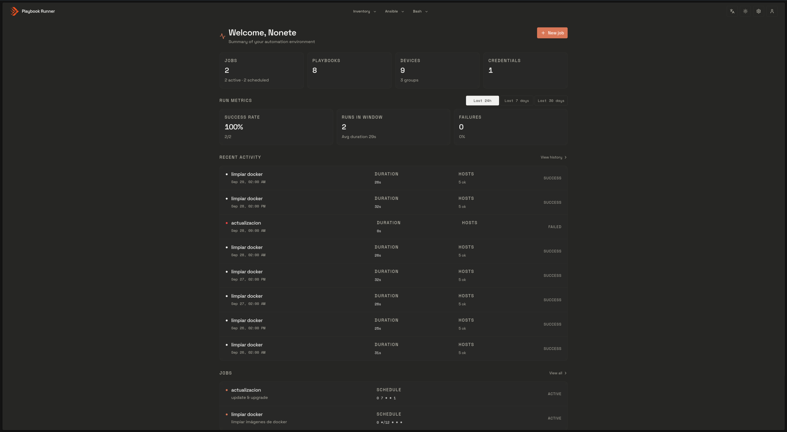
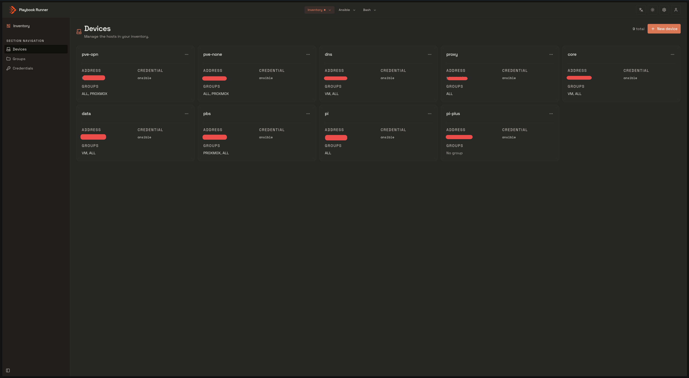
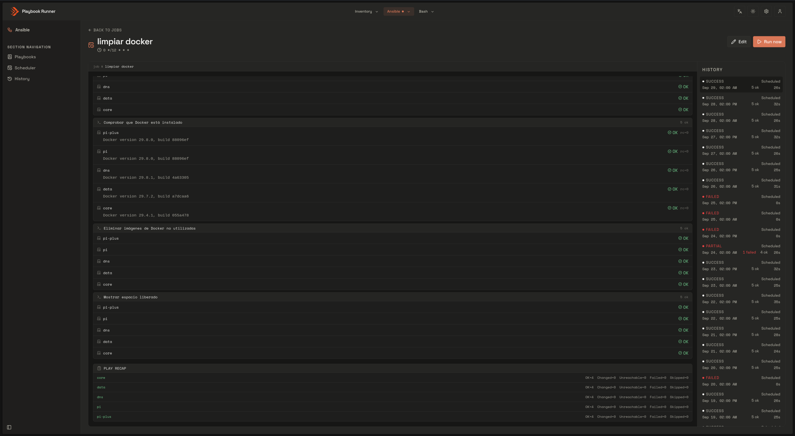
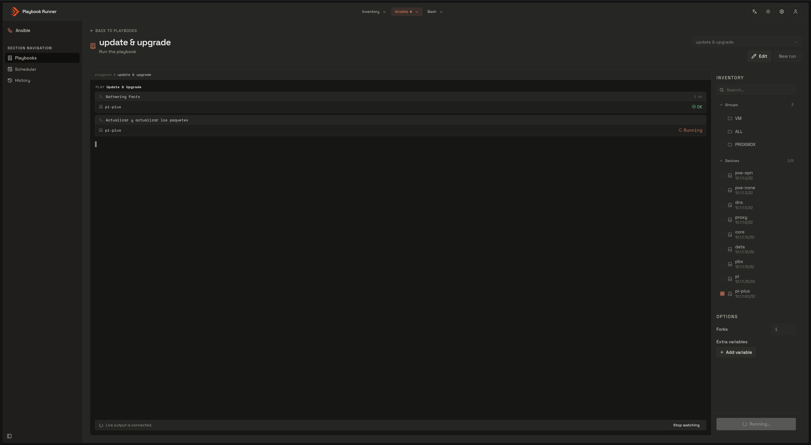
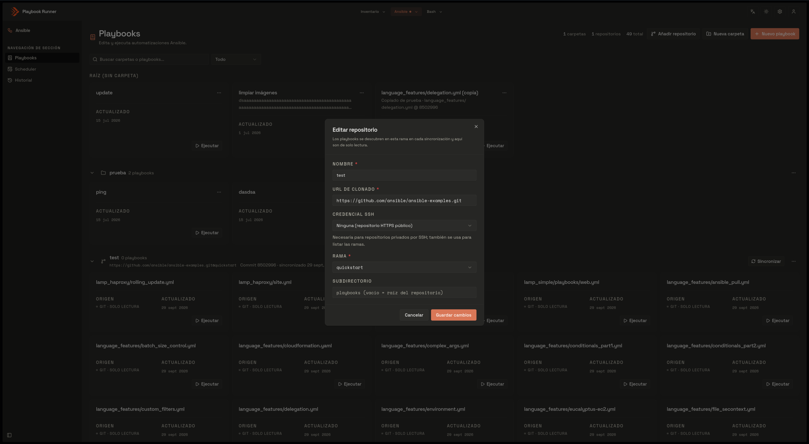
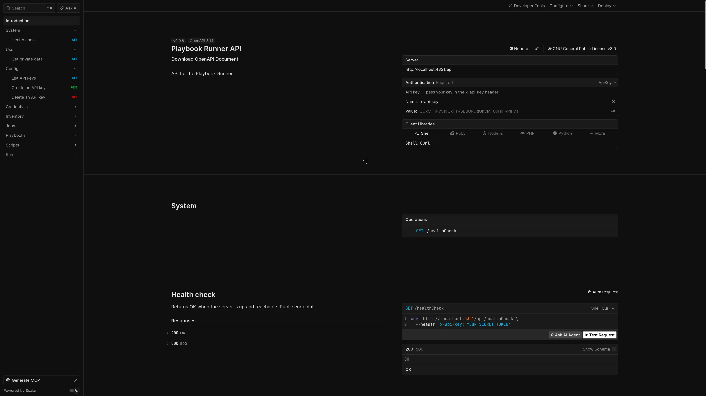
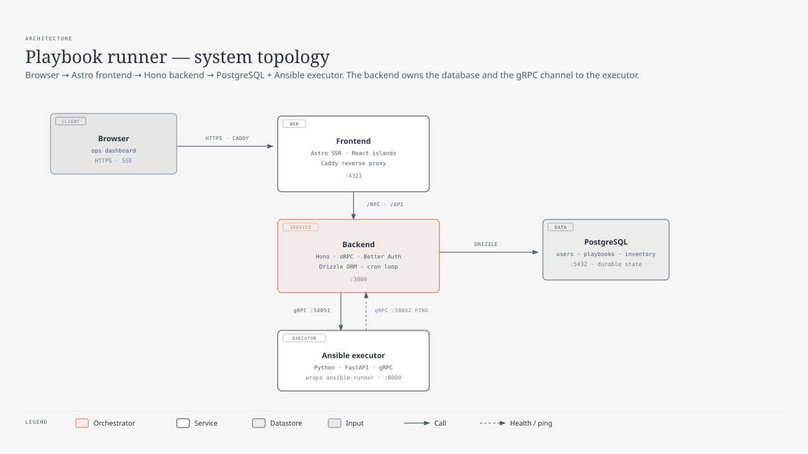

<p align="center">
  
</p>

<h3 align="center">Playbook</h3>
<p align="center">R U N N E R</p>

A self-hosted web UI to manage and run [Ansible](https://www.ansible.com/)
playbooks against your inventory — without the operational weight of AWX or
Ansible Tower.

If you've ever SSH'd into a box, run `ansible-playbook site.yml` and tailed
the output in another terminal, this app gives you a browser tab and a database
for all of that: playbooks (written in the browser or synced from a Git
repository), ad-hoc commands, SSH credentials, devices, groups, scheduled runs,
and a live log of every execution.

## TL;DR — install on a server

Create an empty directory for the deployment, `cd` into it, and run:

```bash
curl -fsSL https://raw.githubusercontent.com/Nonetss/playbook-runner/main/scripts/bootstrap.sh | bash
```

That runs `scripts/bootstrap.sh`, which asks you for the admin user/password and
a few more things, generates every secret with `openssl` (including the
`CREDENTIALS_ENCRYPTION_KEY` that encrypts stored SSH keys), writes a `.env` and a
`compose.yml` **in the current directory** (the production overlay, saved under
that name so a plain `docker compose up -d` picks it up), pulls the images from
`ghcr.io`, and brings the stack up. You end up with everything running at
`http://<your-host>:4321` (or whatever port you chose). See
[Quick start (production)](#quick-start-production) for the manual version.

> The script is interactive even when piped, because it reads your answers from
> `/dev/tty`. It writes into the directory you run it from — not into a clone —
> so an empty folder is all you need. To pin a different version, prefix it with
> `PB_REF=<tag>`.

> [!IMPORTANT]
> Back up the generated `.env`, and especially `CREDENTIALS_ENCRYPTION_KEY`.
> Losing that key makes every SSH private key stored in the database
> unrecoverable.

## Upgrading to the gateway release

The public entry point moved out of the frontend image into its own
`playbook-runner-gateway` image (Caddy): it publishes the site and routes the
backend's gRPC calls to the Ansible service. The frontend no longer publishes a
port. No new required environment variables: the gateway is published on
`GATEWAY_PORT`, falling back to your existing `FRONTEND_PORT`. Refresh the
compose file, then pull and restart:

```bash
curl -fsSL https://raw.githubusercontent.com/Nonetss/playbook-runner/main/compose.prod.yml -o compose.yml
docker compose pull && docker compose up -d
```

## Upgrading to v0.9.0

No new required environment variables. Update the backend **and** Ansible
images together (the gRPC contract gained the Git repository RPCs and the
Ansible image now ships `git`); the backend applies the new database migration
on startup:

```bash
docker compose pull && docker compose up -d
```

Coming from v0.7.x, follow the steps below first.

## Upgrading from v0.7.x

v0.8.0 added a **required** environment variable. The backend refuses to start
without it:

1. Generate a key and add it to your `.env` (next to `compose.yml`):

   ```bash
   echo "CREDENTIALS_ENCRYPTION_KEY=$(openssl rand -base64 32)" >> .env
   ```

2. Back the key up.
3. Refresh the compose file (volumes, ports and healthchecks changed), then
   pull and restart:

   ```bash
   curl -fsSL https://raw.githubusercontent.com/Nonetss/playbook-runner/main/compose.prod.yml -o compose.yml
   docker compose pull && docker compose up -d
   ```

4. Encrypt the credentials that were stored in plaintext before the upgrade
   (run once; `--decrypt` rolls it back):

   ```bash
   docker compose exec backend bun dist/encrypt-credentials.mjs
   ```

Other deployment changes in v0.8: the Ansible service keeps its state in the
`ansible_state` volume (the old `./.data/ansible-runner:/app/playbook` mount and
`ANSIBLE_PLAYBOOK_PATH` are gone), it no longer publishes port `8000` on the
host, and the backend no longer runs a gRPC server (`BACKEND_GRPC_TARGET` and
port `50052` were removed). See the
[release notes](https://github.com/Nonetss/playbook-runner/releases) for
details.

## Screenshots

**Dashboard** — at a glance: jobs, playbooks, devices, and credentials, with
quick-access shortcuts to the most common actions.



**Inventory** — manage devices, groups, and SSH credentials. Assign a
credential to a device so every run picks the right key automatically.



**Job history** — browse every job the server has executed: status, schedule,
and outcome at a glance, with quick access to each run's details.



**Live execution** — output streams into the browser as ansible-runner emits
it. The inventory panel on the right shows which hosts are in scope.



**Git repositories** — add a repository (public HTTPS, or SSH with a stored
credential), pick a branch from the list the remote reports and, optionally, a
subdirectory. Its playbooks sync in as read-only cards you can run and
schedule, next to your folders and inline playbooks.



**API reference** — every endpoint is documented in an interactive OpenAPI
reference (Scalar) served at `/scalar`, with request/response schemas, error
codes, and ready-to-run `curl`/client snippets. The raw spec lives at
`/openapi.json`.



## What you can do with it

- **Inventory** — store devices (host, port, IP) and groups. A device
  belongs to a credential (SSH key + user), so a run can pick a group and
  the right key follows along to every host.
- **Credentials** — store SSH credentials (user + private/public key). You
  can **import** an existing key or **generate** a fresh ed25519 pair right
  in the browser, and copy a ready-made **provisioning script** that creates
  the user, authorizes the public key, and grants passwordless sudo on a
  target host. Private keys are encrypted at rest (AES-256-GCM) and are
  never returned by the API.
- **Playbooks** — write Ansible YAML in the browser, save it, version it in
  the database. No more `scp`ing `.yml` files around.
- **Git repositories** — prefer to keep playbooks in Git? Add a repository
  (public HTTPS, or SSH with a stored credential as deploy key), pick the
  branch from the list of the remote's branches and, optionally, a
  subdirectory. It syncs on save and again whenever you press *Sync*: every
  playbook file on the branch shows up as a read-only playbook you can run
  and schedule. Runs execute from a checkout of the synced commit, so roles,
  templates, `group_vars` and `files/` next to the playbook just work, and job
  history records the commit. *Copy to Playbook Runner* turns one into a
  regular editable playbook (only that file is copied). Galaxy
  `requirements.yml` is not installed, and the repository's `ansible.cfg` is
  ignored.
- **Folders** — group inline playbooks in folders; folders and repositories
  can be collapsed in the playbooks browser.
- **Run on demand** — pick a playbook, pick a group (or a hand-picked set
  of devices), review the confirmation step, click *Run*. Output streams
  into the browser live, so you see `PLAY [...]` and `TASK [...]` lines as
  ansible-runner emits them, with no polling. Closing the tab cancels the
  run on the executor.
- **Scripts** — save Bash or Python scripts and run them on a selection of
  devices/groups, with the same live console as a playbook.
- **Ad-hoc commands** — for quick one-offs that don't deserve a playbook,
  the *Commands* page runs an ad-hoc Ansible module (`shell` or `command`,
  with optional `become`) against a selection of devices/groups and streams
  the output live, same as a playbook run.
- **Schedule jobs** — same thing but with a cron expression. The backend
  keeps a cron loop in-process (`JOB_SCHEDULER_ENABLED=1`) and fires
  scheduled jobs on time. Disable it (`=0`) if you scale the backend to
  multiple replicas and run the scheduler elsewhere.
- **Dashboard** — at a glance: how many devices, credentials, playbooks,
  and recent job runs (with their status).
- **Users & roles** — a closed team: there is no public sign-up. Admins
  create accounts and assign roles (`admin`, `user`, `pending`) from
  */admin/users*; `pending` users can sign in but can't use the app until
  an admin approves them.
- **Multi-user, with SSO** — sign in with email + password (default), or
  with a corporate OIDC provider (Keycloak, Authentik, Google, anything
  OIDC-compliant). The two can run side by side; SSO is opt-in via env
  vars and the app boots fine without it.
- **API keys** — create personal API keys from the *Config* page to call
  the API from scripts or CI (send them as `x-api-key`).
- **Installable on mobile** — the frontend is a PWA, so you can add it to
  your phone's home screen.

## Architecture

Three services compose an Ansible control plane in a single monorepo, behind
a Caddy gateway. The gateway is the only published port: it sends `/rpc`,
`/api`, `/scalar` and `/openapi.json` to the Hono backend and everything else
to the Astro frontend, so the browser sees one origin. The backend owns the
database and dials the executor over gRPC through the gateway's internal gRPC
router, which routes each call by its proto package.



The Python service is deliberately dumb: it has no database connection.
The backend resolves a run (playbook content, a Git source pinned to a
commit, or an ad-hoc command + the deduped hosts and their private keys) against its own database, then calls
the ansible service over gRPC (`RunnerService`, see `proto/run.proto`) with
the already-resolved payload. Ansible materializes a temp inventory + key
files (plus, for Git playbooks, the repository tree exported from its mirror
cache), hands them to `ansible-runner` (playbook mode or ad-hoc module
mode), and streams `RunEvent` frames straight back over that same
server-streaming RPC — no HTTP round trip between the two services (the
browser still gets its live output as an oRPC event stream from the
backend). Calls carry a shared `SERVICE_TOKEN` that the ansible
service's gRPC interceptor checks. All business rules and authorization
live in the backend. Git repository syncs and branch listing go through the
same service (`SyncRepository`, `ListBranches`), which keeps one mirror per
repository in its state directory.

The executor runs at most `MAX_CONCURRENT_RUNS` (default 8) Ansible
processes at once; extra requests are rejected immediately instead of
queueing. A scheduled job never overlaps with itself.

## Stack

- **TypeScript** end to end (strict, no `any` leaking through)
- **Astro** SSR + **React** for interactivity
- **TailwindCSS** + shadcn/ui
- **Hono** + **oRPC** for the API (end-to-end typed procedures)
- **Better Auth** for sessions (email/password + optional OIDC)
- **Drizzle** ORM on **PostgreSQL**
- **Bun** runtime + package manager
- **Biome** for lint + format
- **Turborepo** for the monorepo pipeline
- **FastAPI** + **ansible-runner** for the executor
- **gRPC** (`@grpc/grpc-js` + `grpc.aio`) between backend and ansible, contracts in `proto/`
- **Caddy** as the gateway: public HTTP entry point and internal gRPC router

## Quick start (local dev)

```bash
bun install
cp apps/backend/.env.example apps/backend/.env
cp apps/frontend/.env.example apps/frontend/.env
# In apps/backend/.env, set at least:
#   BETTER_AUTH_SECRET          openssl rand -base64 48
#   CREDENTIALS_ENCRYPTION_KEY  openssl rand -base64 32
#   SERVICE_TOKEN               openssl rand -base64 48 (same value in apps/ansible/.env)
bun run dev
```

`bun run dev` builds and starts the whole stack in Docker (`compose.dev.yml`):
frontend, backend, Ansible service and gateway, each running its own
hot-reload server from source on the host network and reading its
`apps/*/.env`. `docker compose watch` syncs your edits into the containers;
dependency, lockfile and `proto/` changes rebuild the affected image. Stop
with Ctrl+C and remove the containers with `bun run dev:down`. The gateway's
production-like HTTP site is on <http://localhost:8080>.

To run the apps natively instead, use `bun run dev:local` together with
`bun run gateway` (the backend reaches the Ansible service through the
gateway's gRPC router on `localhost:50050`; set
`ANSIBLE_GRPC_TARGET=localhost:50051` in `apps/backend/.env` to skip it). Run
one setup or the other, not both: they use the same ports.

On startup the backend applies the Drizzle migrations and creates the seed
admin if it doesn't exist, so there is no separate migrate/seed step. Open
<http://localhost:4321> and sign in with `admin@playbook-runner.local` /
`admin1234` (or whatever you set in `SEED_ADMIN_*`).

A PostgreSQL is the only external dependency. The easiest way:

```bash
docker run -d --name playbook-runner-pg \
  -e POSTGRES_DB=playbook_runner \
  -e POSTGRES_USER=playbook_runner \
  -e POSTGRES_PASSWORD=playbook_runner \
  -p 5432:5432 \
  postgres:17-alpine
```

Then point `DATABASE_URL` in `apps/backend/.env` at it.

## Quick start (production)

```bash
cp .env.example .env            # replace every CHANGE_ME (see below)
docker compose -f compose.prod.yml --env-file .env up -d
```

Secrets to generate before the first start:

| Variable | Generate with |
| --- | --- |
| `POSTGRES_PASSWORD` | `openssl rand -hex 32` |
| `BETTER_AUTH_SECRET` | `openssl rand -base64 48` |
| `SERVICE_TOKEN` | `openssl rand -base64 48` |
| `CREDENTIALS_ENCRYPTION_KEY` | `openssl rand -base64 32` (back it up!) |

The backend applies the database migrations and creates the seed admin on
every start (the seed is skipped if the admin already exists, and refuses the
default password in production), so `up -d` is all you need.

`compose.prod.yml` pulls three prebuilt multi-arch images
(`linux/amd64,linux/arm64`) from `ghcr.io/nonetss/playbook-runner-*`,
bundles PostgreSQL with a named volume, and wires the right healthchecks
and `depends_on` edges. The CI in `.github/workflows/docker-build.yml`
rebuilds and pushes them on every push to `main` and `v*`.

To swap the bundled PostgreSQL for an external managed DB (RDS, Cloud
SQL, …), delete the `postgres` service from `compose.prod.yml` and point
`DATABASE_URL` at it. Everything else stays the same.

## Example playbooks

A handful of ready-to-run playbooks ship under [`playbooks/`](./playbooks) so you
have something to point a job at the first time you boot the app:

| File | What it does |
| --- | --- |
| [`playbooks/ping.yml`](./playbooks/ping.yml) | Connects to every host and runs `ansible.builtin.ping` — the classic "is SSH + Python working?" smoke test. |
| [`playbooks/apt-upgrade.yml`](./playbooks/apt-upgrade.yml) | Runs `apt update && apt upgrade` on Debian/Ubuntu hosts (with `become: true`). |
| [`playbooks/clean-docker-img.yml`](./playbooks/clean-docker-img.yml) | Prunes unused Docker images on each host (uses `community.docker.docker_prune`) and prints the reclaimed space. |
| [`playbooks/restart-service.yml`](./playbooks/restart-service.yml) | Restarts a `systemd` service (override `service_name`, defaults to `nginx`) and waits until it's `active` again. |
| [`playbooks/disk-usage.yml`](./playbooks/disk-usage.yml) | Runs `df -h` on every host and prints the table — quick storage overview. |
| [`playbooks/check-uptime.yml`](./playbooks/check-uptime.yml) | Prints how long each host has been up and when it booted — handy after a power outage. |
| [`playbooks/gather-facts.yml`](./playbooks/gather-facts.yml) | Dumps a one-line summary per host: OS, kernel, CPU, RAM, IP and FQDN. |
| [`playbooks/fail2ban-status.yml`](./playbooks/fail2ban-status.yml) | Shows the global `fail2ban-client` status and per-jail banned IPs (override `f2b_jails`). |

Treat them as copy-paste starters — open one in the *Playbooks* page, hit
*Run*, pick a group, and you should see the output stream in. To try the Git
integration instead, add this repository
(`https://github.com/Nonetss/playbook-runner.git`, branch `main`, subdirectory
`playbooks`) from *Add repository*.

## Project structure

```txt
playbook-runner/
├── .data/           # Ignored local runtime state (known_hosts, Git mirrors)
├── apps/
│   ├── frontend/    # Astro + React UI (PWA)
│   ├── backend/     # Hono API + oRPC + cron loop + auth
│   ├── ansible/     # Python service wrapping ansible-runner
│   └── gateway/     # Caddy: public entry point + internal gRPC router
├── packages/
│   ├── api/         # oRPC routers and handlers
│   ├── auth/        # Better Auth configuration
│   ├── config/      # Shared tsconfig base
│   ├── db/          # Drizzle schema, migrations, relations
│   ├── env/         # Zod-validated env vars (server + web)
│   ├── grpc/        # Shared TypeScript gRPC infrastructure
│   └── logger/      # Shared structured logging
├── playbooks/       # Example playbooks
├── proto/           # Shared gRPC contracts
├── python/          # Shared Python packages
└── scripts/         # bootstrap.sh installer
```

Persistent Ansible runner state (the SSH `known_hosts` file and the Git
repository mirrors under `repos/`) lives in
`STATE_DIR`: `.data/ansible-runner` in local development (the default, excluded
from Git and Docker build contexts) and the `ansible_state` named volume mounted
at `/app/state` in Docker. Per-run inventories and SSH keys are written to
`RUN_SCRATCH_DIR` and deleted after each run.

SSH host keys are verified according to `SSH_HOST_KEY_POLICY`:
`accept-new` (default, trust on first use and reject changed keys), `strict`
(only hosts already in `known_hosts`) or `off` (no verification, logs a
warning). If a host is legitimately reinstalled, remove its line from
`known_hosts` in the state directory.

The Ansible service is internal-only in `compose.yml`. To reach its HTTP API
(`/docs`, `/scalar`) from the host, add the debug overlay:
`docker compose -f compose.yml -f compose.debug.yml up`.

## Configuration

All runtime config is read from environment variables. The Zod schema
lives in `packages/env/src/server.ts` and validates at startup, so a
missing or malformed var crashes the process early with a clear error
instead of failing in some weird place later.

The two files to know:

- **`.env`** (consumed by `compose.prod.yml`) — everything a deployment
  needs: registry tag pins, the public URL, the DB password, the Better
  Auth secret, `SERVICE_TOKEN`, `CREDENTIALS_ENCRYPTION_KEY`, the OAuth
  client credentials, the seed admin and `SSH_HOST_KEY_POLICY`.
- **`apps/backend/.env`** (local dev; also read by `drizzle-kit`) — the
  full server-side schema.

Copy from `.env.example` and `apps/backend/.env.example` and fill in
`CHANGE_ME` placeholders.

| Variable | Required | Notes |
| --- | --- | --- |
| `DATABASE_URL` | yes | PostgreSQL connection string. |
| `BETTER_AUTH_SECRET` | yes | ≥ 32 chars. |
| `BETTER_AUTH_URL` | yes | Public URL in production; `http://localhost:3000` in dev. |
| `CORS_ORIGIN` | yes | Public frontend URL. |
| `CREDENTIALS_ENCRYPTION_KEY` | yes | Base64 of exactly 32 bytes. Encrypts stored SSH private keys — back it up. |
| `SERVICE_TOKEN` | recommended | ≥ 32 chars, same value on backend and ansible. Authenticates the gRPC link. |
| `ANSIBLE_GRPC_TARGET` | no | Default `localhost:50051` (set by compose). |
| `JOB_SCHEDULER_ENABLED` | no | `1` (default) runs the in-process cron; `0` disables it. |
| `SEED_ADMIN_EMAIL` / `_PASSWORD` / `_NAME` | no | Admin created at startup if missing. |
| `GENERIC_OAUTH_CLIENT_ID` / `_SECRET` / `_ISSUER` | no | All three enable SSO. |
| `SSH_HOST_KEY_POLICY` | no | Ansible service: `accept-new` (default), `strict`, `off`. |
| `MAX_CONCURRENT_RUNS` | no | Ansible service: default `8`. |
| `GIT_TIMEOUT_S` / `GIT_MAX_REPO_MB` / `MAX_CONCURRENT_SYNCS` | no | Ansible service, Git repositories: per-command timeout (default `120`), max mirror size (default `512`), concurrent syncs (default `2`). |
| `LOG_LEVEL` | no | `info` by default. |

## Authentication

The app ships with email/password sign-in enabled out of the box, but
public sign-up is disabled: accounts are created by an admin from
*/admin/users* or provisioned on first SSO sign-in. The `SEED_ADMIN_*`
env vars define the first admin, which the backend creates on startup if
it doesn't exist yet (`bun run db:seed` does the same by hand).

To add a corporate SSO, set the three `GENERIC_OAUTH_*` vars in
`apps/backend/.env`:

```bash
GENERIC_OAUTH_CLIENT_ID=...
GENERIC_OAUTH_CLIENT_SECRET=...
GENERIC_OAUTH_ISSUER=https://your-keycloak.example.com/realms/your-realm
```

The `genericOAuth` Better Auth plugin is loaded conditionally — if any
of the three vars is missing, the plugin is skipped and the server
boots fine with email/password only. Account linking is enabled, so a
user that first signs in with a password can later link their OIDC
identity to the same account.

## Database

PostgreSQL is required. Drizzle migrations live in
`packages/db/src/migrations`.

```bash
bun run db:push          # apply schema directly (dev)
bun run db:generate      # create a new migration from schema changes
bun run db:migrate       # apply pending migrations (the backend also does it on startup)
bun run db:studio        # open Drizzle Studio in the browser
bun run db:seed          # create the default admin user (idempotent)
```

## Docker

Three compose files:

- **`compose.yml`** — builds the four images from the local sources.
  Only the gateway is published on the host; the Ansible state lives in
  the `ansible_state` volume. Add `-f compose.debug.yml` to publish the
  Ansible HTTP API on `:8000`.
- **`compose.dev.yml`** — the hot-reload dev stack behind `bun run dev`
  (see [Quick start (local dev)](#quick-start-local-dev)).
- **`compose.prod.yml`** — production overlay. Pulls prebuilt
  multi-arch images from `ghcr.io/nonetss/playbook-runner-*`, bundles
  PostgreSQL, and wires healthchecks.

```bash
# Local production-like stack
bun run docker:build     # build images from sources
bun run docker:up        # build and start the stack
bun run docker:logs      # tail logs
bun run docker:down      # stop the stack

# Prod (uses .env, pulls prebuilt images)
docker compose -f compose.prod.yml --env-file .env up -d
```

## Scripts

| Command | What it does |
| --- | --- |
| `bun run dev` | Start the Docker dev stack with hot reload |
| `bun run dev:down` | Remove the Docker dev stack |
| `bun run dev:local` | Start all apps natively in dev mode |
| `bun run gateway` | Start only the dev gateway (pair with `dev:local`) |
| `bun run build` | Build all apps |
| `bun run dev:frontend` | Start only the frontend |
| `bun run dev:backend` | Start only the backend |
| `bun run check-types` | Type-check the monorepo |
| `bun run db:push` | Apply DB schema |
| `bun run db:generate` | Generate a new Drizzle migration |
| `bun run db:migrate` | Apply Drizzle migrations |
| `bun run db:studio` | Open Drizzle Studio |
| `bun run db:seed` | Create the default admin user |
| `bun run check` | Run Biome lint/format |
| `bun run format` | Format TypeScript (Biome) and Python (Ruff) |
| `bun run test:e2e` | Run the Playwright E2E suite |
| `bun run docker:build` | Build Docker images from source |
| `bun run docker:up` | Build and start `compose.yml` |
| `bun run docker:logs` | Tail Docker logs |
| `bun run docker:down` | Stop `compose.yml` |

## License

GNU General Public License v3.0. See [LICENSE](./LICENSE).
